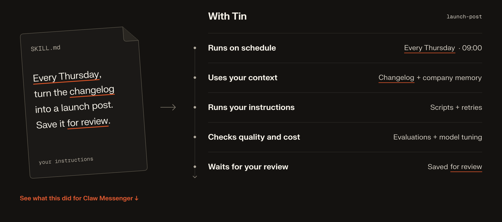
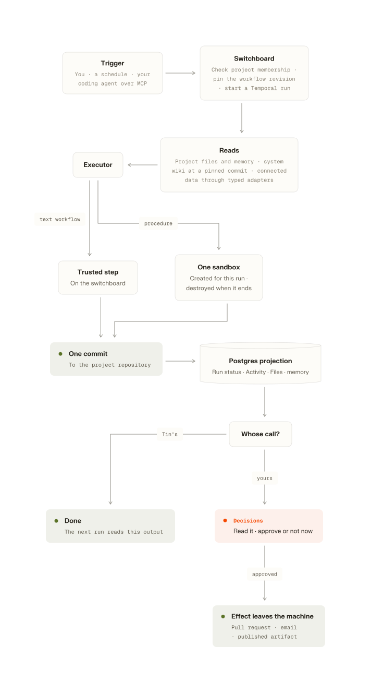

# Tin

Open-source marketing system, designed for coding agents.

Why would you invent marketing from first principles when you can use a battle-tested marketing stack in 10 minutes?

Now with [**26+** reliable workflows](docs/workflows.md) you can use right away. 

[Website](https://tin.computer) · [Try it in the browser](https://app.tin.computer)

## Quick Start

### Connect from a coding agent

The hosted dashboard, API and MCP service use [app.tin.computer](https://app.tin.computer). Add the MCP connection from your project directory.

Claude Code:

```bash
claude mcp add --transport http tin https://app.tin.computer/mcp
```

Then open Claude Code and use `/mcp` to authenticate Tin.

Codex:

```bash
codex mcp add tin --url https://app.tin.computer/mcp
```

Complete the browser login when prompted. For an existing connection that needs authentication, use `codex mcp login tin`.

Cursor, in `.cursor/mcp.json`:

```json
{ "mcpServers": { "tin": { "url": "https://app.tin.computer/mcp" } } }
```

Use Cursor's MCP controls to connect and complete authentication.

Start a new agent session if Tin's tools have not appeared. To check the connection, ask it to call `list_projects`. Your agent can also delete a project you created when you ask it to; it confirms the exact name first, and billing history stays. Then ask:

```text
Use Tin to grow my project like a pro!
```

## A whole agentic marketing system, not a bunch of skills

- **Work that continues between sessions.** Save a workflow with its inputs and a schedule. Tin handles its timers, retries, and waits for your approval.
- **Context that carries forward.** Reports, research, and a project wiki live in a git repository. Later runs don't start from scratch.
- **Workflows you can inspect.** The catalog covers organic growth, content, outreach, product QA, and creative work. Each definition states what it needs, what it produces, and whether it needs review.
- **Review before delivery.** Read an article, request changes, or approve a campaign. GitHub delivery opens a pull request for you to merge.
- **One project across your tools.** Your coding agent and the browser share the same files, run history, and decisions, with the same project permissions.
- **Workflow evaluation, coming.** Each template gets an eval set and a blind second reader, so the workflows get sharper week after week.
- **Growth experiment tracking, coming.** Every change becomes an experiment with a before, an after, and a verdict.

## Use the agent that already knows your project

Connect Tin over MCP in Claude Code, Codex, or Cursor. Your agent can read your local repository, ask you about the business, and use Tin's onboarding workflow to prepare a plan.

It starts with practical questions: what are you trying to achieve, how much time and budget can you put into it, and what should it avoid? The plan uses that context alongside the workflows and integrations available to your project.

For example, the setup conversation might look like this:

```text
› Use Tin to grow my project like a pro!

I'll read the repository first, then help you choose a starting plan.

If organic growth is the priority, we can audit the site, research
buyer questions, and turn the findings into a content plan.
Search Console can add evidence from your current search traffic.
GitHub lets Tin propose site changes as pull requests.

What would a useful result look like in the next sixty days,
and how much time can you spend reviewing work each week?
```

You choose the plan and allow the connections it needs. After approval, Tin creates the selected configurations and starts the initial work it can run. It reports what was set up and what is still blocked. 

## From a useful prompt to work you can rely on

A good skill tells an agent how to do something. Running that skill every week adds other problems: which version should it use, where does its context come from, what happens after a failure, and who approves the result?

Tin handles those parts.



## What you can run

These are the main areas covered by the current catalog. Availability depends on the workflow's inputs, connected services, and operator settings. Some workflows run on demand; others can be saved with a schedule.

| Area | Examples |
|---|---|
| Getting started | A growth plan, integration choices, and setup of the work you approve |
| Organic growth | Site and AI visibility audits, keyword research, content planning, and technical fixes as pull requests |
| Content | Writing-style capture, researched articles, planned drafts, feedback and revisions, approved article delivery to GitHub |
| Cold outreach | A shortlist from Gmail and Calendar, then an approved email campaign with paced follow-ups and reply detection |
| Product QA | Signup walkthroughs, a code map, a feature map, and an audit of the product's features |
| Creative work | Diagrams, brand characters, and product demo videos |
| Project context | A maintained wiki, research reports, and a weekly brief |

For work that does not fit a template, `project.task` gives you a separate Codex task with its own conversation and controls. It can ask questions, pause, and resume. Changes to project files require approval of the proposed diff.

A content plan's dates are editorial targets, not automatic publication times. You can start generation individually; the current organic traffic system can also continue from planning into the next eligible draft, review and delivery. Tin can report that an item is already covered or needs better evidence instead of forcing out another article. Approved content becomes an unmerged PR when GitHub delivery is selected; otherwise its Markdown stays in project Files. This does not schedule six months of automatic drafting or publish a website.

The live Registry is the source for each workflow's inputs and requirements. [docs/architecture.md](docs/architecture.md) explains how the main pieces fit together.

## Give it the context you would give a colleague

A repository says a lot about how a product works. It says less about why customers buy it, what they misunderstand, or how you want to sound. Add the material that fills those gaps: customer interviews, support questions, research, and examples of your own writing.

Your project can also hold `SKILL.md` files under `.agents/skills/`. Workflows load the skills they declare, such as a writing-style guide. Tin can help extract that guide from samples you select, and you can edit it directly. A skill in your local repository is not automatically available to a hosted run; your agent needs to save the relevant material to the Tin project.

Public articles and planned drafts support feedback in the reader or through MCP. Tell Tin what to change, compare the revision, and approve the version you want. Generation notes stay separate from public copy. With GitHub delivery configured, an approved article can become a pull request; approval does not merge or deploy it.

## Connect the services the work needs

Connections belong to projects. A workflow uses specific operations from each integration, and Tin checks access before running them.

| Connection | What it enables | Boundary |
|---|---|---|
| Google Search Console | Read search performance for a property you select | Read-only access |
| GitHub App | Read a selected repository and open a pull request with proposed changes | No merge or push to the base branch; credentials stay on the server |
| Google Workspace | Research Gmail and Calendar history; send approved campaigns | Reads and sends go through the project's declared capabilities |
| Claude Code, Codex, Cursor | Use Tin through MCP, including files, workflows, and supported review actions | Every call checks the user's project membership |

GitHub and Google tokens stay on the switchboard, Tin's server. Sandbox tools receive the permitted data or access through a grant tied to the run. Product QA can use a separate Tin test identity to sign into the product it is testing.

For data from Google Docs and Drive, analytics providers such as GA4 and PostHog, or advertising platforms, add relevant exports to project files.

## Bring your own workflows

Start with ordinary Python when you know the steps. Add managed model calls where the work
needs judgment; a workflow can have several of them, with code handling the sequence,
branches and validation. Use a Codex procedure when an agent needs to explore and choose
the steps itself.

All three can be contributed as public workflow packages:

```text
workflow_packages/<workflow>/
├── workflow.json
└── main.py          # Python, optionally calling managed models
```

A procedure package uses `PROMPT.md` and `skills/` instead of `main.py`. The manifest declares
typed inputs, bounded outputs, integrations and review. Maintainers review contributions and
explicitly select packages for the Registry; catalog sync publishes each selected package as
one pinned version. Existing runs and saved configurations keep their selected version.

See [Adding a workflow](docs/adding-a-workflow.md) and the
[deterministic and two-model-step examples](workflow_packages/README.md). Native code and
model-backed workflows can also be contributed when the bounded package runtime isn't enough.

### Private workflows

The bounded private-workflow pilot uses the same Python contract: typed inputs, isolated
execution, optional managed model calls, project API connections, durable reports, and
eligible daily or weekly schedules.
Your coding agent authors and tests the package; Tin runs it independently. Code-only
bounded compute needs no model credentials or Tin credits. Hosted model calls use Tin credits;
connected API usage belongs to that provider account.

See [code workflows](docs/code-workflows.md), [managed model steps](docs/code-model-workflows.md),
and [secure project API connections](docs/project-api-connections.md) for examples, exact
limits, setup, and verification. [Private code schedules](docs/code-workflow-schedules.md)
reuse saved workflow scheduling; paid occurrences need standing spending authority.

Private workflows live in a project's files and still require operator enablement. A coding agent writes a package, validates it, and explicitly activates it through MCP. Code workflows produce a bounded text artifact. Private Codex procedures can produce a project artifact or an unmerged GitHub PR, but remain on demand. Direct SDK credentials in author code and general one-command skill imports are not supported. See [feature status](docs/feature-status.md) for the supported-versus-experimental boundaries.

Public or private determines who can use a workflow, not whether it runs code or an agent.

## Case study: from $45 to $2,105 a month in four months

[Claw Messenger](https://clawmessenger.com) gives AI agents an iMessage number. The original Tin agent worked on its growth from March to July 2026. This predates the workflow engine in this repository; that experience shaped its workflows.

| | |
|---|---|
| Project | Claw Messenger, developer tools |
| Timeline | 25 March to 27 July 2026, 124 days |
| Monthly revenue | $45 to $2,105 |
| Paying customers | 5 to 257 |

The reported figures come from Claw's Stripe and PostHog data, filtered to Claw plans. The work included pages answering buyer questions, site fixes, outreach, and weekly reviews. These are historical results from the earlier system, not a benchmark or a promise of results from this repository.

## How it is built

Tin's server coordinates the work. Temporal keeps runs alive across failures and waits. Files hold the results, and Postgres holds the state the product reads.

<picture>
  <source media="(prefers-color-scheme: dark)" srcset="docs/diagrams/how-it-is-built-dark.svg">
  
</picture>

[Source](docs/diagrams/how-it-is-built.mmd) · Open SVG: [light](docs/diagrams/how-it-is-built-light.svg) / [dark](docs/diagrams/how-it-is-built-dark.svg)

The web app is the interface you open in your browser. The separate browser inside E2B is controlled by the agent. Arrows show calls and work dispatch; sandbox results return to Tin's server for validation and storage.

- **The switchboard** is the FastAPI service behind the product, API, and MCP server. Its workers execute workflow code, create sandboxes when needed, call integrations, and validate writes to project files.
- **Temporal** coordinates runs, schedules, retries, and waits for input. Its history carries identifiers and small control values. Prompts, files, and credentials stay outside that history. Waiting for review does not keep a sandbox or model running.
- **E2B sandboxes** give Codex a temporary workspace with the files and instructions selected for the run. Browser workflows also run Camoufox inside that sandbox to visit websites or test a product. Results are checkpointed before the sandbox is removed. Small text workflows call models directly from trusted activities.
- **code.storage** holds one git repository per project. Outputs survive the sandbox and have a revision you can inspect.
- **Postgres** holds project membership, chat, run status, and decisions. Product status reads do not depend on querying Temporal.
- **Model access** separates native model calls from sandboxed Codex execution. Hosted defaults use protected API runners for supported new Codex runs, including browser, Studio and interactive tasks. Historical artifacts remain available; retired OAuth runs cannot start new compute. Tin does not require a ChatGPT login or `auth.json`. Provider keys and integration credentials stay on the switchboard; a sandbox is not given your GitHub or Google token.

A typical artifact-producing run looks like this. Its workflow determines whether review or external delivery is part of the job:

<picture>
  <source media="(prefers-color-scheme: dark)" srcset="docs/diagrams/one-run-dark.svg">
  
</picture>

[Source](docs/diagrams/one-run.mmd) · Open SVG: [light](docs/diagrams/one-run-light.svg) / [dark](docs/diagrams/one-run-dark.svg)

The switchboard checks the active run's lease and the repository's `expectedHeadSha` before making a commit. For procedure outputs, a conflicting destination edit preserves the new result for you to resolve. Completed-step receipts let a retry reuse work that is already done.

That is the foundation: files and recorded results carry forward, while the process that produced them can be replaced. [docs/architecture.md](docs/architecture.md) goes into more detail; [AGENTS.md](AGENTS.md) records the implementation boundaries and acceptance checks.

### Run Tin yourself

You host Tin's server on your infrastructure and connect it to Temporal Cloud, E2B, code.storage, Clerk, and Postgres through accounts you control. You pay infrastructure and model providers directly; Stripe is optional.

This is currently an engineering setup path, not a verified turnkey installer. A clean-clone
acceptance run and usable `.env.example` are still outstanding; see [self-hosting limits](docs/feature-status.md#source-release-and-self-hosting-limits).

You need Python 3.12 and [uv](https://docs.astral.sh/uv/). Clone and install:

```bash
git clone https://github.com/tin-computer/tin.git
cd tin
uv sync
```

Configure the database and migration roles, Temporal namespace, storage, Clerk, E2B, and model access in a local `.env`. The [service settings](src/tin_lite/settings.py) and [identity and integrations guide](docs/auth-and-integrations.md) list the configuration. Keep credentials out of git.

Then apply migrations, publish the catalog, build the sandbox templates your workflows require, and start the service. It starts the Temporal worker as well:

```bash
uv run tin-lite migrate
uv run tin-lite sync-builtins
uv run python sandbox/template.py
uv run tin-lite serve
```

Customer billing is optional when self-hosting. With `TIN_LITE_BILLING_ENABLED=false`, you pay your own infrastructure and provider costs without needing Stripe or a Tin credit balance.

Self-hosted UI and portable diagrams use bundled open-source Geist fonts. Hosted Tin's licensed brand font is served separately; see [font configuration and source-distribution notes](docs/font-serving.md).

The [engineering reference](docs/engineering.md) covers service configuration, local checks, and deployment.

## What is next

The direction is broader coverage with less setup, while keeping the work inspectable.

- **More workflows and connections.** Extend product QA into fixes, add analytics sources, and build out lifecycle marketing and paid ads. These need their own provider and approval rules.
- **Better evaluation.** Build workflow-specific evaluation sets and a calibrated chat evaluation harness. Measure whether the work is useful, as well as whether the run completed.
- **Experiment tracking.** Record the intended outcome of a change, the metric, and the measurement window, then compare it with what happened.
- **More control.** Let projects choose which eligible workflow decisions can run automatically. Make private workflow authoring and upgrades easier.
- **Easier operation.** Add deployment options that reduce dependence on the current managed services, plus notifications that bring people back when a run needs attention.

## Open source, Apache 2.0

Tin is licensed under the [Apache License 2.0](LICENSE). This repository contains the service and built-in workflows, including the instructions you need to inspect or change them. Third-party components retain their own licenses; see [third-party notices](THIRD_PARTY_NOTICES.md).

See [CONTRIBUTING.md](CONTRIBUTING.md) for development checks and pull requests,
[SECURITY.md](SECURITY.md) for private vulnerability reporting, and
[feature status and release readiness](docs/feature-status.md) for current limits and outstanding release gates.
The [documentation index](docs/README.md) groups contributor and self-hosting guides.

Made by [Ege Özgirin](https://www.keketerminal.com), who built AI agents at Oda and then Keke, his autonomous AI artist, and [Emre Şarbak](https://linkedin.com/in/emresarbak), who helped build [LaunchCode](https://www.launchcode.org), [Kodluyoruz](https://www.kodluyoruz.org), [Patika](https://www.patika.dev), [Rise In](https://www.risein.com), and [SuperSense](https://www.supersense.app).

We have spent a lot of time building agents that can do useful work. Tin is about making that work easier to organize, repeat, and improve. We run the hosted version at [app.tin.computer](https://app.tin.computer), and the same code is here for people who want to operate it themselves.

Also from us: [with.md](https://github.com/tin-computer/with-md), [Personality Machine](https://github.com/tin-computer/personality-machine), and [Personaplex fine-tuning](https://github.com/tin-computer/personaplex-finetune).
