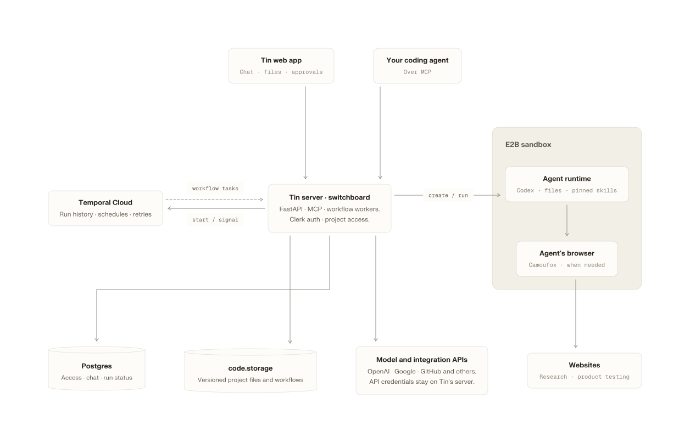
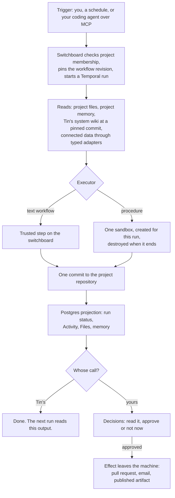

# How Tin Lite is built

The switchboard serves the product and coordinates its workers. Temporal keeps workflow state across failures and waits; project files hold the results.

<picture>
  <source media="(prefers-color-scheme: dark)" srcset="diagrams/how-it-is-built-dark.svg">
  
</picture>

[Source](diagrams/how-it-is-built.mmd) · Open SVG: [light](diagrams/how-it-is-built-light.svg) / [dark](diagrams/how-it-is-built-dark.svg)

Tin's web app runs in the user's browser. The browser inside E2B is controlled by
Codex to visit websites or test a product. Arrows show calls and work dispatch;
sandbox results return to the trusted server for validation and storage.

- The **switchboard** serves the product, HTTP API, and MCP server. Its trusted workers call integrations and validate writes to project state. Browser, chat, schedules, and MCP clients use the same workflow services and project-membership checks.
- **Temporal** coordinates runs, timers, retries, and waits for input. History carries identifiers and small control values; prompts, files, and credentials stay outside it. Waiting for review does not keep a sandbox or model running.
- **E2B sandboxes** provide temporary workspaces for Codex. Tin's workers select the project files and pinned skills, create or recover the sandbox, and validate its results before a canonical write. Browser workflows run Camoufox inside the sandbox. Small text workflows run as trusted activities without a sandbox.
- The **project repository** is memory. Reports, drafts, lists, and the wiki index are files with history, readable by any tool that reads files.
- **Postgres** holds what the product shows. No screen queries the workflow engine.
- **Integrations** are typed adapters with capability lists. Tokens stay on the switchboard and never enter a sandbox. A procedure that needs your data gets a short-lived grant bound to one run through a separate internal MCP server, for the reads its workflow declared. Every provider call writes a receipt.

Codex execution uses brokered ChatGPT sessions or an API relay according to the execution configuration. The relay uses the switchboard-held `TIN_LITE_LUNA_API_KEY`; that key never enters the sandbox. Authentication is selected before execution and retained through retries. `OPENAI_API_KEY` and `CODEX_API_KEY` are not accepted service settings.

## One run

A later run reads the saved project context its workflow selects. Completed-step receipts support recovery without relying on a surviving sandbox or model session. Project chat is durable in Postgres, but it is not automatically included in every workflow.

## Access model

| Connection | Tin can | Tin cannot |
|---|---|---|
| Google Search Console | list your verified properties, read a bounded analytics panel for the one you select | write anything; the scope is read-only |
| GitHub, as an App you install | read a selected repository and open a pull request within the workflow's declared change budget | push to your base branch, change CI, store a personal token, hand a token to a sandbox |
| Google Workspace | read Gmail and Calendar, send mail only from inside a campaign you approved | send outside a campaign, read another project's mailbox |
| Project deletion, by the project's creator | stop its running work, remove its schedules, disconnect its integrations, remove its repository, hide it from every member | undo it, delete the workspace, erase billing history |

## Further choices

- **A real browser when needed.** The product QA workflows drive a fingerprint-hardened Firefox inside the sandbox through a bounded set of MCP tools. The agent writes no browser scripts. Tin mints the test identity: an email alias on your connected mailbox, a receive-only phone number for SMS codes, a test card for card-gated trials. The password is encrypted on the switchboard, and any report that contains it is refused.
- **Uncertain sends are reconciled.** A campaign pins its recipients, copy, cap, pacing, and send window before you approve it. Each delivery has a stable key and a ledger entry. If the provider's answer is ambiguous, Tin re-reads rather than retries. A reply suppresses the follow-up.
- **Outputs compound.** Saved artifacts can become project memory. Later runs and chat can use that context without retaining the process that produced it.
- **Design first.** Every screen is drawn in Paper before it is coded, and the code cites the board it implements.

Managed dependencies today: Temporal Cloud, E2B, PlanetScale Postgres, code.storage, Clerk, and DataForSEO for the organic audit's crawl.

## Three workflows, end to end

### Visibility audit, then an answer page

You start `visibility.audit` for a project, optionally naming a target. Tin resolves the target's name, domain, and aliases, writes five buyer questions that do not name the target, asks each one to a model twice (web search on, then no tools), and scores every answer: found, mentioned, evaluated, shortlisted, picked first. One commit publishes `reports/AI_VISIBILITY.md` and the raw evidence. No review.

Next Monday you run `content.answer_page`. It reads that audit, picks the strongest question you were absent from, and drafts one page that answers it with sources. The draft lands in Files and shows up in Decisions. Approval completes this draft workflow. Planned articles have a separate path: `content.generate` supports feedback and revisions, and approved articles can be delivered to GitHub through configured delivery or `content.deliver`. Neither path merges the resulting pull request.

### Site health as a pull request

You connect GitHub, select the repository, and opt in to write access. You start `site.health_improve` with your site URL, a focus such as accessibility, and a change budget of one to three files. In a sandbox, the agent reads the live page and the repository, reads the open pull requests so it does not duplicate work, picks one evidenced defect, fixes it, and writes a PR description with the evidence, the change, and the verification. The switchboard opens the pull request with a short-lived installation token the sandbox never saw. The pull request stays unmerged. Your repository's own deployment process determines when an accepted change goes live.

### Email shortlist, then a campaign

You connect Google Workspace and start `outreach.email_shortlist` with an objective, say "people I met at events in the last ninety days who asked about pricing". The sandbox gets a run-bound grant to read Gmail and Calendar and writes `outreach/email/SHORTLIST.csv` with a reason and evidence per row. You edit the CSV in Files or from your coding agent and mark rows as selected.

Then `outreach.email_campaign`: subject, body, optional follow-up and delay, daily cap, send window in your timezone. Tin snapshots the selected rows and the copy and shows you the send plan. You approve. Sends pace out inside the window, each recorded with the provider's message ID. A reply drops that person from the follow-up. You can revise copy for recipients not yet sent, or stop the campaign, from the browser or over MCP.

## Example workflows

This is a selection, not a complete catalog. The live Registry lists current inputs, prerequisites, integration requirements, and availability. An entry without a required user connection may still need operator-configured providers and a spending limit.

| Workflow | What it does | Needs | Your call? |
|---|---|---|---|
| `organic.audit` | Crawls up to 100 public pages for technical SEO issues, asks a fixed panel of buyer questions to an AI adviser, reports whether the answers mention, cite, or recommend you | nothing | no |
| `visibility.audit` | Asks five buyer questions to a model with and without web search and scores where you appear | nothing | no |
| `content.answer_page` | Drafts one researched page for the strongest unanswered buyer question | nothing | yes |
| `site.health_improve` | One small evidenced fix on one public page, as a pull request | GitHub | the PR is yours to merge |
| `outreach.email_shortlist` | Evidence-backed shortlist from your Gmail and Calendar history, as a CSV | Google Workspace | no |
| `outreach.email_campaign` | Paced sends with reply-aware follow-ups, from selected rows and approved copy | Google Workspace | yes, before anything is sent |
| `qa.signup_walkthrough` | Signs up for your product as a stranger with a Tin-owned identity and reports the issues it encounters | Google Workspace | no |
| `product.code_map` | Writes the code map section of memory from the connected repository | GitHub | no |
| `product.deep_dive` | Writes the feature map section of memory from docs, the live product, and the code map | Google Workspace | no |
| `qa.product_audit` | Tests features from the feature map and records results and coverage limits | Google Workspace | no |
| `scan.report` | What you have, what is missing, what to run first | nothing | no |
| `project.weekly_brief` | What moved, what needs attention, the smallest useful next steps | nothing | no |
| `project.memory` | Keeps the project wiki index current from durable outputs | nothing | no |
| `content.design_md` | Writes `DESIGN.md` from your repository | GitHub | no |
| `research.deep_dive` | Tests one project question against current, source-backed evidence | nothing | no |
| `content.public_article` | A researched article with feedback and revisions | project context | yes |
| `content.generate` | The next eligible article from a saved content plan, or an assessment explaining why it should not be drafted | prepared brief and writing guide | yes, when it produces an article |
| `growth.onboarding` | A growth plan followed by setup of the work and connections you select | product context and founder constraints | yes, before setup |
| `content.diagram` | One Tin-styled diagram whose Mermaid source stays editable in Files | nothing | yes |
| `project.task` | One bounded Codex task for work no workflow covers; modifying tasks return a diff you approve | nothing | yes, for any change to your files |
